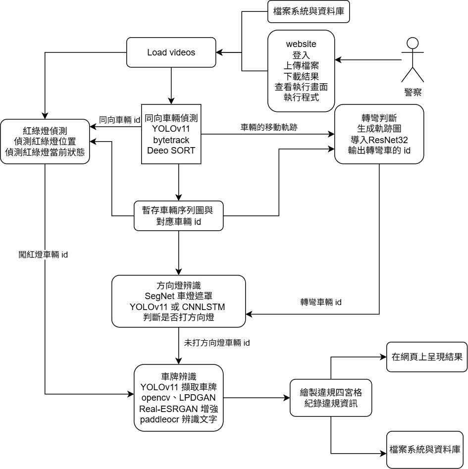
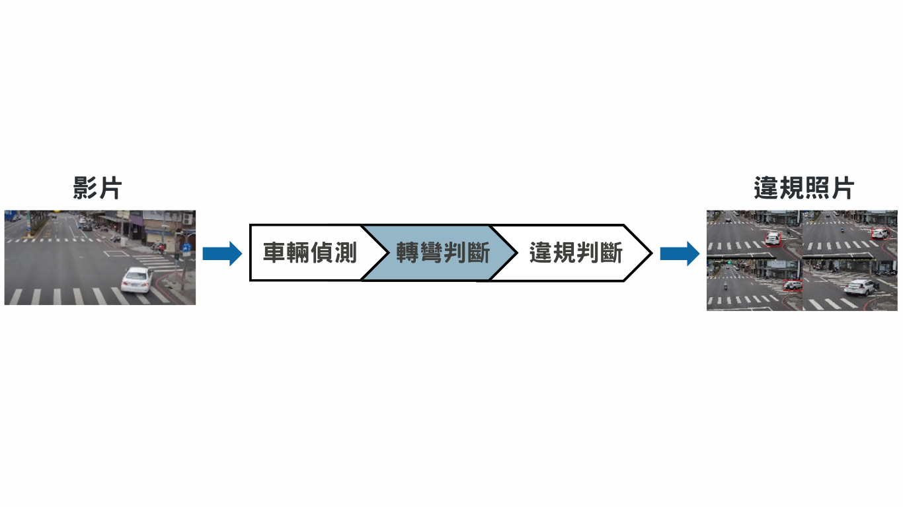

# 即時車輛違規系統

## 簡介
  本系統將整合多種深度學習模型，例如 YOLO、SegNet、ResNet、Transformer 以及 CNN-LSTM 等，針對不同的特徵學習方式進行比較與優化，最終製成適合違規偵測的模型。
  功能之一為辨識車輛在轉彎時是否全程正確開啟方向燈，透過深度學習模型分析路口監視器影像中車輛的移動軌跡，並結合方向燈變化的時序資訊，確保系統能準確偵測方向燈的狀態。
  此外，系統將考量多種影像影響因素，例如晝夜的光照差異、雨天的視線不良、車燈反光與路口監視器影像解析度低等問題，以提升在各種環境條件下的辨識能力與穩定性。
  為了進一步提升執法效率，本研究亦將開發違規偵測系統的網頁介面，提供員警即時監看與舉發的工具。網頁將顯示各路口監視器的即時畫面，並以紅框標註違規車輛，自動截取違規畫面，製成違規四宮格圖，並識別出車牌號碼，作為舉發依據，幫助員警快速製單舉發，提升執法的便捷性與準確度。
  未來，本系統可進一步擴展至偵測更多類型的交通違規，諸如違規臨停、未禮讓行人、超速、行人違規穿越車道等，並與現有的科技執法系統整合，推動智慧交通管理的發展。


## 使用環境
- **作業系統**： Linux 
- **開發環境**：本地開發 (localhost)
- **伺服器環境**： PHP server with Port Forward (端口轉發)
- **程式語言**： 
  - PHP 
  - Python
- **資料庫**：SQLite3


## 前置準備

1. **安裝所需套件:**
   
    - python == 3.8
    - pandas == 2.0.3
    - numpy == 1.24.3
    - opencv-python == 4.10.0.84
    - torch == 2.4.0+cu118  
    - torchvision == 0.19.0+cu118
    - torchaudio == 2.4.0+cu118
    - ultralytics == 8.3.21
    - pillow == 10.4.0 
    - matplotlib == 3.7.5
    - tqdm == 4.66.5
    - websockets == 13.1


## 訓練與測試

### 訓練模型
1. 執行訓練指令：
    - 轉彎判斷模型
      ```bash
      python ResNet_train/train.py
      ```
    - 
    - light_model_method--SegNet
      ```bash
      python SegNet/train.py
      ```

    - light_model_method--CNNLSTM
      ```bash
      python CNNLSTM/train.py
      ```
    

### 測試模型
1. 執行測試指令：
   - 轉彎模型
      ```bash
      python ResNet_train/test.py
      ```
   - 系統主程式
      ```bash
      cd main
      python main.py --name demo_video  --save 1,1,1,1
      ```
      demo_video: 測試影片的資料夾路徑    
   - light_model_method--SegNet
      ```bash
      python SegNet/test.py --samples test_folder --outputs output_folder
      ```
      test_folder：測試影片的資料夾路徑  
      output_folder：存放輸出結果的資料夾路徑  
     
     

## 功能說明
1. **light_model_method--SegNet:**
   - 輸入：車輛照片
   - 輸出：車燈遮罩
  
1. **light_model_method--CNNLSTM:**
   - 輸入：車輛序列
   - 輸出：是否違規
     
2. **系統主程式：輸入車輛影片，檢測該影片中車輛是否有違規行為。**
   - 輸入：車輛影片資料
   - 輸出：違規車輛的照片以及相關資訊
  
3. **網頁：提供執行程式的網頁，包含手動執行以及自動執行。**
   - 登入
   - 自動偵測：供使用者即時查看網頁中播放的影片之違規資訊。
   - 上傳影片：供使用者上傳想要單獨偵測的影片。
   - 手動偵測：供使用者選擇影片並手動執行程式去做偵測。
   - 搜尋違規車：供使用者查看上傳影片的偵測結果。

## 模型架構



## 系統流程



  
     
## 文件結構

```bash
|-- Real-Time-Detection-of-Traffic-Violation/
    |-- turn_model_train/  # 轉彎模型訓練    
    |-- light_model_train/ # 車燈模型訓練
        |--train.py  
    |-- main/              # 系統主程式
        |--demo_video/     # 存放輸入影片
        |--weight/
           |--yolo11m.pt   # 車輛追蹤
           |--turn.pth     # 轉彎判斷
           |--light.pt     # 方向燈亮暗與違規判斷
           |--transformer_yolo_weight.pth   # 方向燈亮暗狀態判斷
           |--yolo_light_train2_best.pt     # 方向燈區域擷取
        |--screenshot.py
        |--main.py                          # 系統主程式
        |--car_track.py                     # 車輛偵測與追蹤
        |--turn.py                          # 轉彎判斷
        |--turn_model.py                    # 轉彎模型
        |--light.py                         # 方向燈亮暗與違規判斷
        |--screenshot.py                    # 產生違規照片
        |--config_max.py                    # 系統參數設定
        |--dataLoad_max.py                  # 資料載入
        |--test_new.py                      # 方向燈區域擷取
        |--test_max_transformer.py          # 方向燈亮暗狀態判斷
        |--model_max.py                     # ResNet34 與 TransformerEncoder 組合的方向燈亮暗狀態識別模型實作
    |-- light_model_method    # 車燈模型改善方法
        |-- CNNLSTM/             
        |-- SegNet/ 
    |-- RT_DTV_website           # PHP website
        |-- app/                 # PHP app
        |-- database/            # SQLite3 資料庫
        |-- public/              # 前端文件
            |-- style.css        # 前端樣式
        |-- scripts/             # 訓練與測試的 Python 腳本
            |-- main_website.py  # 網站自動化偵測違規
    |-- output/                             # 存放所有結果
        |-- demo_video/
            |-- video/
                |-- video_output.webm       # yolo bounding box video
                |-- carimg/                 # 儲存車輛序列圖
                |-- turn_info/              # 儲存車輛軌跡圖以及轉彎模型預測結果
                    |-- turn_predict.csv    # 轉彎模型預測結果
                |-- light_info/             # 儲存亮暗波型圖以及違規模型預測結果
                    |-- light_predict.csv   # 違規模型預測結果
                |-- violation/              # 儲存違規照片 
    |-- README.md          # 專案說明文件
    |-- turn_signal_position_detection/
        |-- dataset/        # 資料與標註集
            |-- images/
                |-- train/
                |-- test/
                |-- val/
            |-- labels/
                |-- train/
                |-- test/
                |-- val/
            |--dataset.yaml
        |-- input/          # 輸入要擷取方向燈區域的車尾圖
        |-- output/         # 模型輸出圖片存放
        |-- runs/           # yolo 方向燈擷取模型訓練成果
        |--test_new.py      # 方向燈擷取模型測試
        |--train_yolo_light_location.py     # 方向燈擷取模型訓練

```
