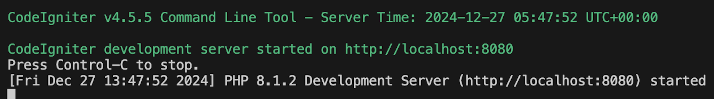
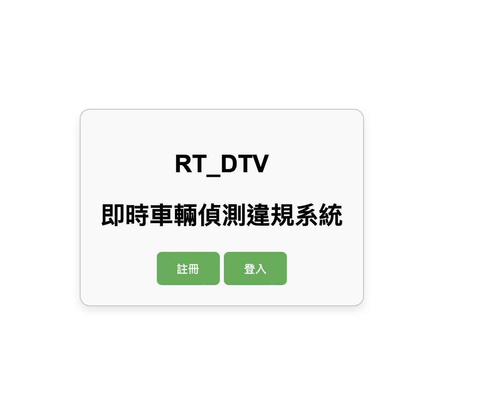
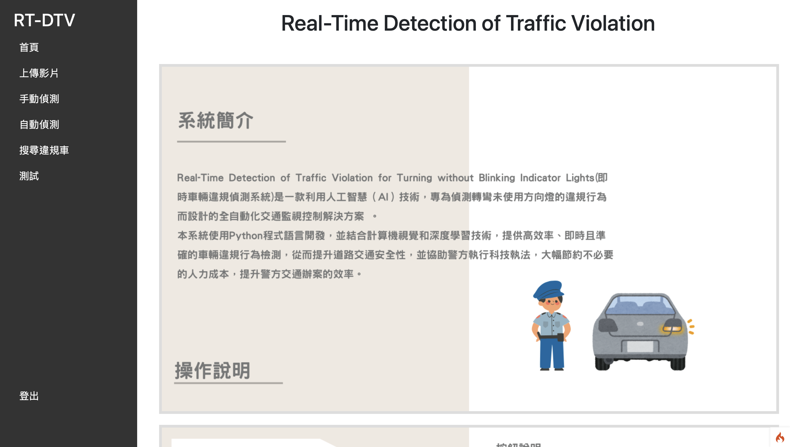

## 1.需要修改的路徑

a. RT_DTV_website/app/config/App.php

Line20 : baseURL(架設的伺服器IP，可自行更改為想要的port)

b. RT_DTV_website/app/Controllers/LiveFeedController.php

Line56 : python_path(python環境執行檔 ex .../python.exe)

c. RT_DTV_website/app/Controllers/LiveFeedController.php

Line55 : $video_name(ex ...\\RT_DTV_website\\public\\python\\error 欲偵測的影片須放在此資料夾) 

Line56 : $python(python環境執行檔 同b.)

Line57 : $script(ex ...\\RT_DTV_website\\public\\python\\main.py)

Line58 : $workingDir(ex...\\RT_DTV_website\\public\\python)

d. RT_DTV_website/app/Commands/Websocket.php

Line16: 改成自己的 python_path(python環境執行檔 ex .../python.exe)

## 2.網站啟動指令

### 步驟1： cd 到 RT_DTV_website資料夾

### 步驟2： 輸入指令 php spark serve --host 0.0.0.0 (開啟server) 

如果失敗，可先輸入並執行 composer install

成功會顯示以下畫面

### 步驟4：檢查網頁是否成功啟動

a. 點擊步驟1生成的網址，進入登入畫面

b. 輸入帳密後，進到首頁

## 3.網頁登入的帳密

帳號 : a

密碼 : a

也可自行註冊帳號

### 步驟5： 違規圖片儲存

a. 執行RT_DTV_website/public/python/main.py輸出的圖片會存在RT_DTV_website/public/output/error/影片名稱/violation

b. 將輸出圖片都移出影片檔的資料夾至RT_DTV_website/public/videos/result即可顯示在違規管理中

   (這個部分的串接還在調整中，目前需要先手動移檔案)

### 步驟6: 即時畫面影片來源

a. 欲顯示在四格即時影像的影片須放在RT_DTV_website/public/videos/folder1 至 RT_DTV_website/public/videos/folder4 內，分別代表四個即時畫面的視窗輪播